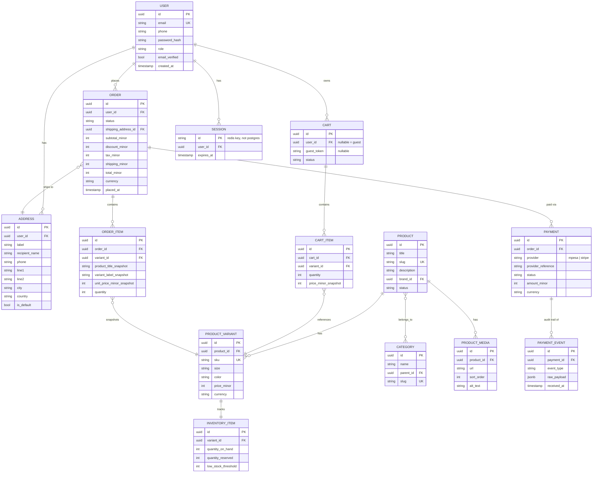

# Data Model Overview

Status: **conceptual — table/field names are indicative, not final DDL.** Exact schemas (types, constraints, indexes) get nailed down per-module during the deep-dive pass, then expressed as `golang-migrate` migrations. This doc exists so the shape of the data is reviewable before that.

All monetary amounts are stored as integers in the currency's minor unit (cents / lowest KES unit), never floats. All tables get `id UUID`, `created_at`, `updated_at`; soft-deletable entities also get `deleted_at`.

## Core commerce flow (MVP)

`SESSION` lives in Redis, not Postgres — included above only to show the relationship.

## Entity inventory by module (fields indicative, not exhaustive)

| Module | Key entities |
|---|---|
| identity | `user`, `address`, `email_verification_token`, `password_reset_token` |
| catalog | `product`, `product_variant`, `category`, `product_category`, `brand`, `attribute`, `attribute_value`, `size_chart` |
| inventory | `inventory_item`, `stock_adjustment` |
| media | `product_media` |
| pricing | `promotion`, `coupon`, `coupon_redemption`, `tax_rule` |
| cart | `cart`, `cart_item` |
| order | `order`, `order_item`, `order_status_history` |
| payment | `payment`, `payment_event`, `refund` |
| shipping | `shipping_zone`, `shipping_rate`, `fulfillment`, `tracking_update` |
| returns | `return_request`, `return_item`, `return_status_history` |
| review | `review`, `review_photo` |
| wishlist | `wishlist_item` |
| notification | `notification_log`, `notification_template` |
| analytics | `event` (raw), `daily_metric_rollup` |
| admin | `audit_log` |
| search | no dedicated storage at MVP — reads catalog via Postgres FTS (`tsvector` column on `product`) |

## Notable design decisions

- **Order line items snapshot product/variant data** (`product_title_snapshot`, `unit_price_minor_snapshot`) rather than joining live to `product`/`product_variant` — a price change or product rename after purchase must never alter historical orders or receipts.
- **Cart items snapshot price at add-time** (`price_minor_snapshot`) but are *revalidated* against current price/stock at checkout — the snapshot is for display continuity in the cart UI, not the source of truth at payment time.
- **Payments are not 1:1 with orders** — one order can have multiple payment attempts (failed M-Pesa push, retry with Stripe), and `payment_event` is an append-only audit trail of every webhook/callback received for that payment, independent of the `order_status_history` audit trail.
- **`inventory_item.quantity_reserved`** exists separately from `quantity_on_hand` so "available to sell" = `on_hand - reserved`, supporting the checkout-time soft reservation described in spec.md §3 without a separate reservations table at MVP (add one later if reservation expiry/observability needs grow).
- **Guest carts** use a `guest_token` (opaque, stored in a cookie) instead of `user_id`; on login/registration, the guest cart's items are merged into (or replace, per a rule to decide during checkout deep-dive) the user's persisted cart.

Full DDL, indexes, and constraints are written as migrations during implementation, reviewed per-module alongside that module's deep-dive spec — not speculatively created now.
