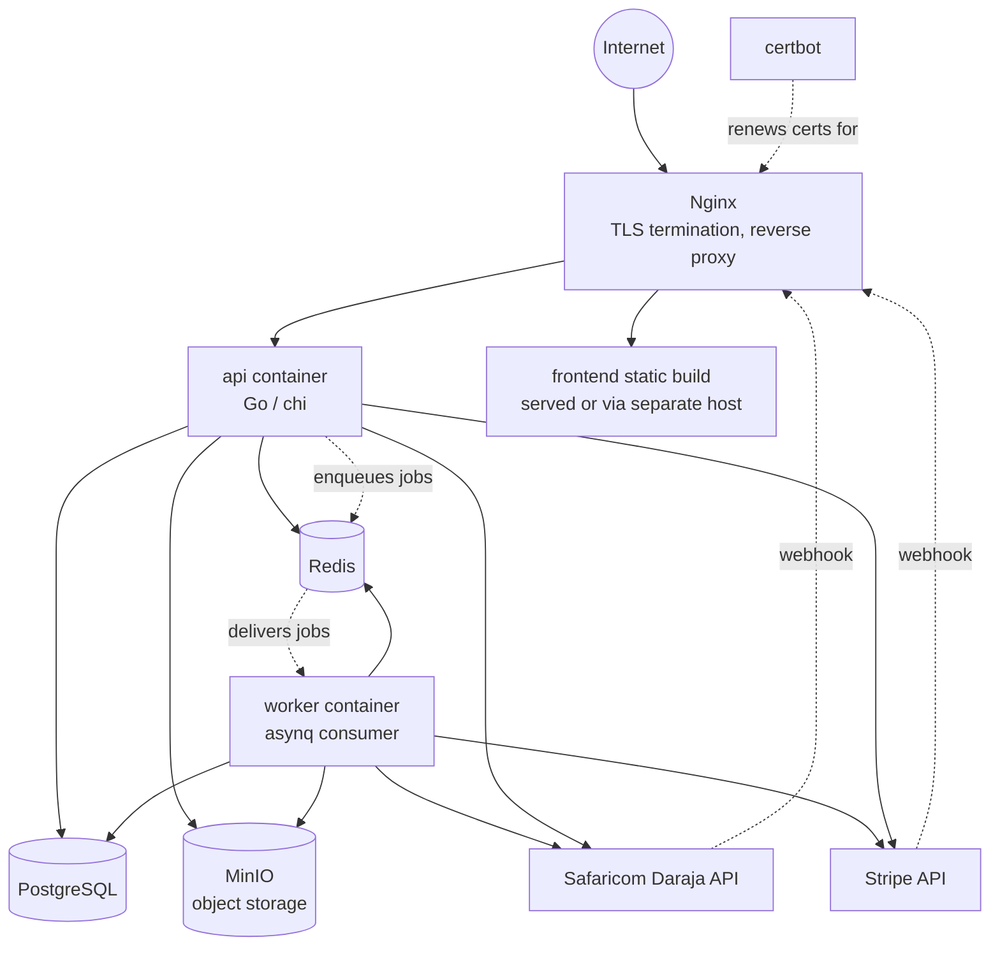
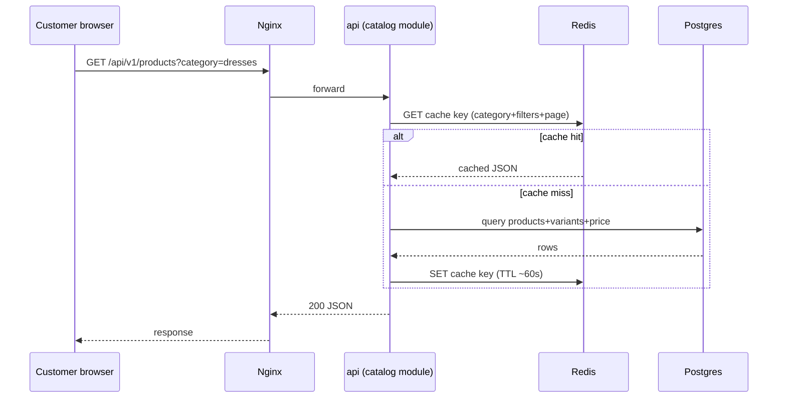
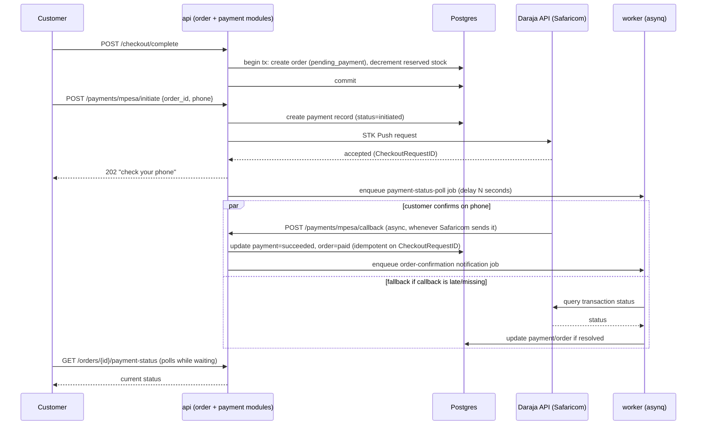
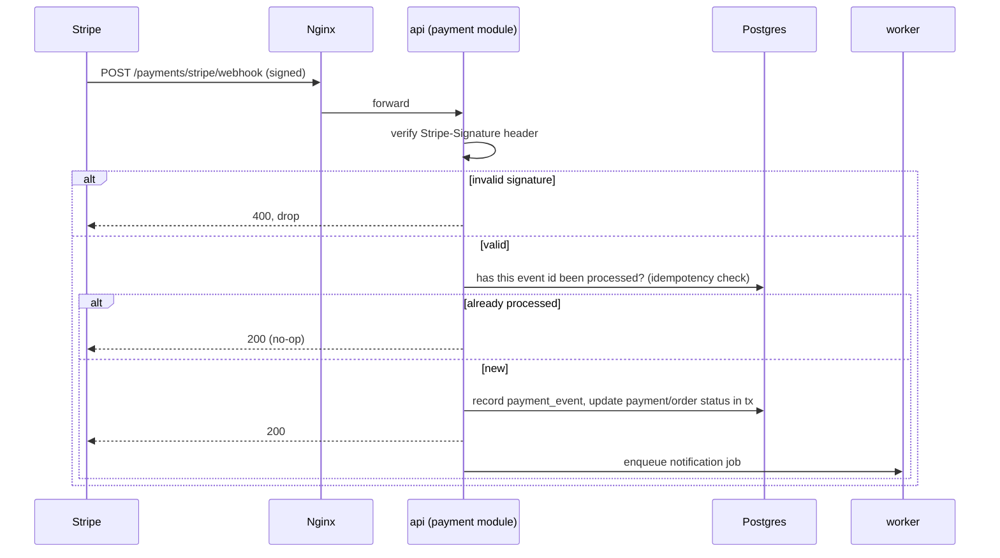

# System Design

Status: **planning.** Covers how the pieces run together in production and the key request flows. See [architecture.md](architecture.md) for internal code structure and [spec.md](spec.md) for functional scope.

## 1. Deployment topology (single VPS)

Everything ships as Docker containers orchestrated by `docker-compose.prod.yml` on one VPS: `api`, `worker`, `postgres`, `redis`, `minio`, `nginx`. Nginx is the only container exposed to the internet (ports 80/443); everything else talks over the compose-internal network. Postgres and Redis get a named Docker volume for persistence; MinIO gets one for object storage.

**Why one VPS, not managed cloud services**: that's the given constraint. The hexagonal `ports` boundary means swapping self-hosted Postgres/Redis/MinIO for managed equivalents (RDS, Elasticache, S3) later is an adapter-config change, not a rewrite, if/when the store outgrows one box.

## 2. Request flow: browsing (cache-through read)

Catalog reads are the highest-traffic, most cacheable path (products change far less often than they're viewed). Short TTL (tens of seconds) rather than event-driven invalidation at MVP — simpler, and stale-for-a-minute is an acceptable trade-off for a storefront. Move to explicit invalidation-on-write if that TTL proves too coarse.

## 3. Request flow: checkout with M-Pesa

The fallback poll job exists because Safaricom callbacks are not guaranteed to arrive promptly (a known operational reality of Daraja) — the frontend polls order status, but the backend doesn't *depend* on the customer's browser staying open to eventually reconcile payment state.

## 4. Request flow: Stripe webhook

## 5. Caching strategy (Redis)

| What | Key shape | TTL | Invalidation |
|---|---|---|---|
| Product listing/detail reads | `catalog:products:{hash of filters}` | ~60s | time-based only at MVP |
| Category tree | `catalog:categories` | 5 min | time-based, or on admin write (cheap to do explicitly since writes are rare) |
| Guest cart | `cart:guest:{token}` | 30 days sliding | explicit on mutation |
| Session data | `session:{session_id}` | sliding, e.g. 7 days | explicit on logout |
| Rate limiting counters | `ratelimit:{ip or user}:{route}` | fixed window, e.g. 1 min | expires naturally |
| Checkout stock reservation | `reservation:{variant_id}:{cart_id}` | short, e.g. 10 min | explicit on payment success/failure or expiry |

Authenticated carts and orders are Postgres-first (durability matters more than latency there); Redis is for things that are either disposable (cache) or inherently ephemeral (guest cart, session, reservation).

## 6. Session & auth flow

1. Login succeeds → generate random 256-bit session ID → `HSET session:{id} user_id ... role ... issued_at ...` in Redis with TTL → set cookie (`Secure; HttpOnly; SameSite=Lax`).
2. Every request through `platform/session` middleware: read cookie → `HGETALL session:{id}` → if present, refresh TTL (sliding expiration) and attach user to request context; if absent, treat as anonymous/guest.
3. Logout → `DEL session:{id}` + clear cookie.
4. Admin/staff sessions use the same mechanism with a shorter TTL and (P2) a 2FA step before the session is marked fully authenticated.

## 7. Background job catalog (asynq, Redis-backed)

| Job | Trigger | Why async |
|---|---|---|
| Send transactional email/SMS | any notification-worthy event | provider latency shouldn't block the request |
| M-Pesa payment status poll | payment initiated, no callback within threshold | Daraja callback delivery isn't guaranteed prompt |
| Stripe webhook side effects (beyond the DB update done inline) | webhook received | keep webhook response fast, avoid provider retries from timeouts |
| Release expired stock reservation | reservation TTL expiry (or explicit check job) | checkout abandoned without payment |
| Abandoned cart reminder (P2) | cart inactive N hours | scheduled/delayed job |
| Nightly analytics rollup | cron-style schedule | batch aggregation, not request-time work |
| Low-stock admin alert | inventory crosses threshold | debounced notification, not per-unit spam |

## 8. Analytics pipeline (P2/P3)

Client events (`POST /events`) and server-side domain events both land in an `event` table (raw, append-only). A nightly `asynq` job aggregates the prior day into `daily_metric_rollup` rows that the admin dashboard reads from — the dashboard never scans raw events directly, so it stays fast regardless of raw event volume. Revisit moving raw events to a purpose-built store (e.g. ClickHouse) only if Postgres struggles at real volume — not a day-one concern.

## 9. Security posture

- TLS terminated at Nginx (Let's Encrypt via certbot, auto-renewed).
- Argon2id password hashing; session cookies `Secure`+`HttpOnly`+`SameSite=Lax`; CSRF token required on state-changing requests.
- Rate limiting (Redis-backed token bucket, via chi middleware) on `/auth/*` and `/payments/*` to blunt credential stuffing and payment abuse.
- Webhook endpoints: Stripe signature verified; M-Pesa callback validated against Safaricom's published source IPs plus the fallback status-poll job as a correctness backstop.
- Least-privilege Postgres role for the app user (no superuser, no `DROP` in production credentials); migrations run with a separate, more privileged role during deploy only.
- Secrets (DB password, Redis password, Mpesa consumer key/secret, Stripe secret key, session signing material) live in environment variables injected at deploy time — never committed, never logged.
- Dependency and container image scanning as part of CI before deploy (P2 — add once the pipeline exists).

## 10. Observability

- `log/slog` JSON logs to stdout, collected by Docker's logging driver; rotate via Docker's `max-size`/`max-file` log options so a single VPS disk doesn't fill up.
- `/healthz`, `/readyz` on both `api` and `worker` (worker's readiness = Redis reachable).
- `/metrics` (Prometheus format) — Prometheus + Grafana added as two more containers on the same VPS once there's enough traffic to make dashboards worth having (not part of the MVP compose file).
- Alerting (P2): a simple uptime check (e.g. an external ping service) on `/healthz` before investing in a full alerting stack.

## 11. Backup & disaster recovery

- Nightly `pg_dump` (or `pg_basebackup` for larger data volumes later) to a separate disk/off-VPS location (e.g. object storage bucket outside the VPS itself, or a second cheap VPS) — a backup that lives on the same disk as the database it backs up isn't a backup.
- MinIO data (product images) backed up on the same schedule, or mirrored to an external object store.
- Documented, *tested* restore procedure — a backup nobody has restored from is a hypothesis, not a backup. Add a periodic "restore into a scratch environment" check once the pipeline exists.
- Redis data is treated as disposable (cache/session/queue) — losing it costs logged-out sessions and requeued jobs, not data loss, so it is explicitly *not* part of the backup plan.

## 12. Scaling path (not needed at MVP, noted for later)

Single VPS, vertically scaled, is the right starting point. If/when it's outgrown: `api` is stateless (session lives in Redis, not memory) so it can run as multiple containers behind Nginx load balancing before anything else needs to change; Postgres read replicas for read-heavy catalog traffic; move MinIO/Postgres/Redis to managed services behind the same ports if operating them becomes the bottleneck rather than the app. None of this is a day-one concern — noted so today's decisions (stateless api, ports-based infra access) don't accidentally foreclose it.

## 13. CI/CD (sketch — detailed once repo exists)

GitHub Actions: on push to `main` — run `go vet`/lint, run unit + integration tests (Postgres/Redis via service containers), build Docker images, push to a registry (GHCR), then SSH into the VPS and `docker compose pull && docker compose up -d` plus run pending migrations before the new `api` container takes traffic. Mirrors the Makefile targets defined once implementation starts (`make test`, `make build`, `make deploy`).
